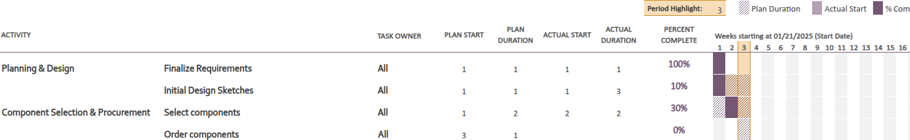

# Bi-weekly Progress Report 1
**Joe Spielbauer, Trey Vokoun, Yusuf Halim, Zach Ramsey**  
*2/11/25*

## 1. Progress update according to Gantt chart with over/under of progress vs. plan
The team is currently in the brainstorming, research, and design phase of the project.  
There have been roadblocks with researching the embedded controllers to use, and designing the antenna.

<!-- if there is a software component-->

## 2. Update of teamwork: who is doing which tasks
> ### Task 1:
> The team settled on project deliverables and completed the final draft of the project proposal.
> 
> Team Member    | Task                         | Status
> ---------------|------------------------------|-------
>  All           | Settle on final deliverables | Complete
>  All           | Project proposal final draft | Complete

> ### Task 2:
> Trey is researching compatible uCs for the embedded demo and procuring the necessary hardware.
> 
> Team Member    | Task                    | Status
> ---------------|-------------------------|-------
>  Trey          | Research compatible uCs | Complete
>  Trey          | Order uCs               | In Progress

> ### Task 3:
> Zach is performing time-complexity and space-complexity analyses for the ML models to ensure > hardware is capable of inferencing the model. 
> 
> Team Member    | Task                                     | Status
> ---------------|------------------------------------------|-------
>  Zach          | Determine the input data size and rate   | Complete
>  Zach          | Estimate the shape of model architecture | In Progress
>  Zach          | Validate hardware capability             | In Progress
  
<!--!-->
<!--!-->

## 3. Describe any new bottleneck/hurdle discovered and a plan to address it
There are a lot of moving parts and disparate components that need to be coordinated better. We are setting up a 'github project,' similar to a gantt chart, that can operate as a more dynamic means of organizing our efforts and keeping track of who is working on what.

We are also limited by available hardware to begin prototyping the demonstration. The esp32 we have does not support ethernet without an external controller, and we do not have an alternative yet.

## 4. If behind schedule, provide a plan to address it
We plan to carve out additional meeting times for the team, and to make plans going in to the meeting what we plan to work on. Additionally, we plan to discuss next steps at the end of each meeting so everyone is aware what the others in the team are working on. 

## 5. Describe the steps for the next two weeks (what each person will be working on each week)
> ### Week of 2/11/25:
> The team will procure components for the embedded deliverable and start prototyping code for the embedded control group, starting with a simple WIFI protocol implementation such thatthe bandwidth requirements to our compression network. 
>
> Zach and Yusuf will continue research and design of the encoder/decoder framework and determine what training data will be used.

> ### Week of 2/18/25:
> Trey will be in charge of placing an order for embedded controllers, and start planning and researching potential roadblocks for the control group code.
> 
> Joe will finalize the plan for hardware needed in the transmitting and receiving for both the embedded and robotics demonstrations, specifically finding any external hardware requirements.
> 
> Zach and Yusuf will begin developing the software for training the encoder/decoder model.
> 
> Joe will attempt to prototype wireless communication between two esp32s, showing live video transmission if possible.
